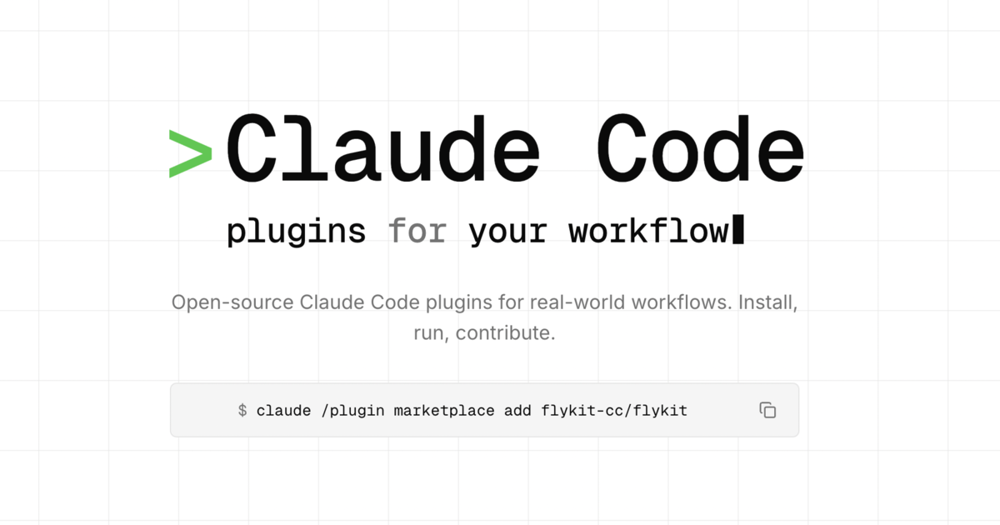

<div align="center">


# flykit-web

**The public landing page at [flykit.cc](https://flykit.cc).**

[](./LICENSE)
[](https://nextjs.org)
[](https://react.dev)
[](https://tailwindcss.com)
[](https://flykit.cc)

<br/>

<a href="https://flykit.cc">
  
</a>

</div>

---

Companion repo to [**`flykit-cc/flykit`**](https://github.com/flykit-cc/flykit), the open-source Claude Code plugin marketplace.

## Thinking of contributing?

**Plugin data lives in the [flykit](https://github.com/flykit-cc/flykit) repo, not here.** If you want to add or edit a plugin — its tagline, features, skills, or tags — that's a PR against `flykit-cc/flykit`. This site re-fetches plugin data on every build and via 1-hour ISR, so upstream changes show up here automatically.

What *does* belong in this repo:

- Design, copy, typography, layout
- New pages (e.g. `/blog`, `/showcase`, `/changelog`)
- Bug fixes, accessibility, perf tuning
- SEO metadata, OG image updates

PRs welcome for any of the above.

## Stack

- **Next.js 15** (App Router) + **React 19** + **TypeScript**
- **Tailwind CSS 3** + **shadcn/ui** primitives
- **Geist Mono** (chrome) + **Inter** (prose) — the mono/sans split is the core typographic signal
- Deploys to Vercel via GitHub Actions on every push to `main`

## Develop

```bash
pnpm install
pnpm dev        # http://localhost:3000
```

The site builds against a local `lib/plugins-fallback.json` so it works offline. At runtime it fetches `marketplace.json` + each plugin's `web.json` from `flykit-cc/flykit` via GitHub raw URLs, with 1-hour ISR.

## Build

```bash
pnpm build
pnpm start
```

## Project layout

```
app/
  layout.tsx              Root layout (fonts, header, footer)
  globals.css             Design tokens + grid-paper utility
  page.tsx                Home
  docs/                   Getting-started
  plugins/[slug]/         Plugin detail (static, generated from marketplace)
  privacy/, terms/        Legal
  opengraph-image.png     OG + Twitter card (social previews)
  icon.tsx, apple-icon.tsx Favicons
  not-found.tsx           404 with ASCII countdown
components/
  ui/                     shadcn primitives
  site-header.tsx         Sticky nav
  site-footer.tsx         4-col footer
  logo.tsx                Wing mark
  rotating-word.tsx       Hero rotating word + blinking cursor
  code-block.tsx
  announcement-bar.tsx
lib/
  plugins.ts              Marketplace fetcher (GitHub raw + fallback + stars)
  plugins-fallback.json
  utils.ts
public/
  logo.svg                Wing mark, standalone
  logo-{512,1024}.png     Transparent PNGs
  logo-white-512.png      Reversed, for dark backgrounds
```

## License

[MIT](./LICENSE) © [kaiomp](https://github.com/kaiomp)
